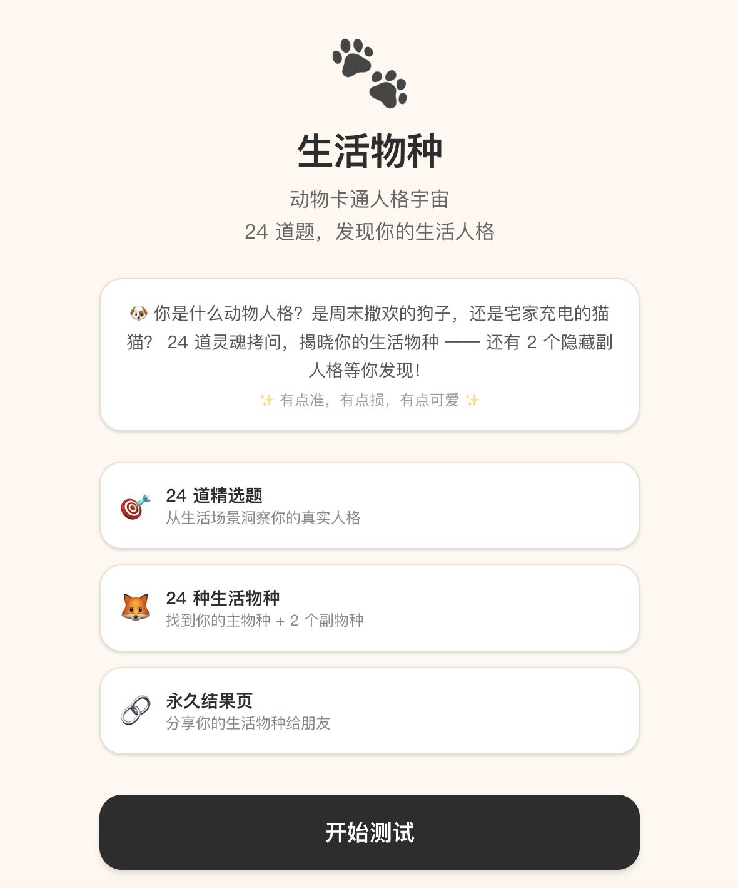

# 生活物种 · COZE 编程最终开发提示词 v1.3（交付包）

> 移动端优先的「生活物种」人格测试 Web 网站 —— 交付物为给「扣子（COZE）编程」的**最终开发提示词 v1.3 + 素材包**，用于实现一个带 Supabase 后端数据库的移动端优先 Web 应用。
> 项目状态：**DONE（提示词与素材交付完成）**。本仓库同时含一份完整可运行的 Next.js 16 + Supabase MVP（已部署预览：https://5dnqscfrmp.coze.site/）。

## 在线预览

- 预览地址：https://5dnqscfrmp.coze.site/
- 首页效果：



---

## 一、项目简介

「生活物种」是一个 24 道测试题 → 18 个隐藏维度 → 24 个 `species_key` → 主物种 + 2 个跨 family 副物种 的人格测试产品。本仓库交付的是**最终开发提示词 v1.3** 与配套素材，供开发者（或 COZE 编程智能体）据此完整实现一个带 Supabase / PostgreSQL 后端的 Web 网站。

目标架构：Supabase / PostgreSQL 后端 + 移动端优先 Web；核心前端页面为 `/`、`/test`、`/r/{share_code}`（永久结果分享链接）。

---

## 二、仓库内容（Source of Truth）

| 路径 | 说明 |
|---|---|
| `docs/pm/life_species_coze_prompt_v1_3_FINAL.md` | **主需求 / 开发规范（COZE 提示词 v1.3，唯一权威）** |
| `docs/pm/PLAN.md` | 计划骨架（待补充） |
| `docs/qa/QA_CHECKLIST.md` | 回归清单（待补充） |
| `docs/qa/BUGS.md` | 缺陷跟踪（待补充） |
| `docs/review/CODE_REVIEW.md` | 代码审查（待补充） |
| `docs/review/PRODUCT_BACKLOG.md` | 产品优化 backlog（待补充） |
| `docs/handoff/HANDOFF.md` | 交接文档（项目性质、状态、整理记录） |
| `docs/roles/*.md` | 角色规范骨架（builder / code-reviewer / planner / product-reviewer / qa，待补充） |
| `AGENTS.md` | 项目结构事实与协作约定（neat-freak 2026-08-18 建立） |
| `species_assets_v1/` | 24 张正式角色 PNG（按 part1/2/3 解压目录存放；实施时需合并为同一 `public/assets/species/`） |
| `species_assets_v1_part1/2/3.zip` | 原始素材分包压缩包（本地保留；**已通过 .gitignore 排除，不重复入库**） |
| `scratch/` | 临时 / 冗余副本（**已通过 .gitignore 排除**） |

> 评分算法与图片映射为「交付规范」的一部分，正式代码实现时须遵循提示词中的 `life_species_calibrated_scorer_v1.mjs` 与 `life_species_supabase_seed_manifest_v1.json`（详见提示词正文）。

---

## 三、关键约束（实施时务必遵守）

1. **最高优先级规则**：先完整读取交付包中的 `00_START_HERE/README_FIRST.md` 与 `00_START_HERE/life_species_coze_master_prompt_v1_2.md`（旧规范基础），但 **v1.3 提示词为最新修订版**，冲突时以 v1.3 为准。
2. **禁止自行重新设计 / 修改**：24 道测试题、18 个隐藏维度、24 个 `species_key`、校准后的正式评分算法、主物种 + 2 副物种规则、Supabase 数据结构、永久结果链接机制、RLS / 数据库安全边界、正式角色图片文件名、已确定的视觉方向。
3. **正式评分器**：生产环境只允许使用 `life_species_calibrated_scorer_v1.mjs`（版本 `mvp-1.2-calibrated`）。禁止让前端自行维护另一套评分逻辑，正式物种判断不得由 AI 临时生成。
4. **确定性**：同一份答案 + 同一测试版本 + 同一评分器版本，必须永远得到相同结果。
5. **图片映射**：24 张正式 PNG 命名与 `species_key` 固定绑定，**禁止重命名 / 翻译 / 改扩展名**；`manifest.csv` 不上传、不部署、不作为映射依据。
6. **安全边界**：高权限信息（Supabase `service_role`、`DATABASE_URL`）仅允许服务端环境变量，**严禁进入前端 bundle**。
7. **MVP 暂不实现**：登录注册、朋友互评、双人匹配、排行榜、社区、私信、AI 聊天。

---

## 四、评分模块验收标准（自动测试）

开发完成后必须运行：

```bash
node life_species_calibrated_scorer_test_v1.mjs
```

必须全部达标，否则评分模块视为未完成：

- `24 / 24` fixture 主物种命中
- `deterministic = true`
- `crossFamilySecondary = true`
- `inputValidation = true`
- `status = PASS`

---

## 五、素材实施要点

- 实施时须将 `species_assets_v1_part1/2/3` 三个目录解压合并为**同一个** `public/assets/species/`（24 张 PNG），**禁止**生成 part1/2/3 子目录。
- `manifest.csv` 不随前端部署。

---

## 六、目录结构

```
.
├── AGENTS.md
├── README.md
├── docs/
│   ├── pm/          # 计划、主需求/开发规范（v1.3 提示词）
│   ├── qa/          # 缺陷、回归清单
│   ├── review/      # 代码审查、产品 backlog
│   ├── handoff/     # 交接文档
│   └── roles/       # 角色规范骨架
├── species_assets_v1/   # 24 张正式角色 PNG（part1/2/3 子目录）
└── species_assets_v1_part1/2/3.zip  # 原始分包（本地保留，未入库）
```

---

## 七、仓库约定

- **私有仓库**，仅作为交付包归档与协作基线。
- 已通过 `.gitignore` 排除：`scratch/`（冗余副本）、根目录 3 个分包 ZIP（与已解压 PNG 重复）、本地密钥/环境变量。
- 如需将原始分包 ZIP 纳入版本库，移除 `.gitignore` 中对应条目后重新 `git add` 即可。

---

## 八、已知事项 / 后续 TODO

- `docs/pm/PLAN.md`、`docs/qa/QA_CHECKLIST.md`、`docs/roles/*.md` 等为规范骨架，建议后续补充。
- 无传统运行态代码；完整 Web 实现由开发者依据 v1.3 提示词完成。
- 验收基线建议按提示词「最终 P0 验收」清单建立回归测试。

---

*本仓库由 neat-freak 于 2026-08-18 整理，遵循规范模板 v2.3。*
